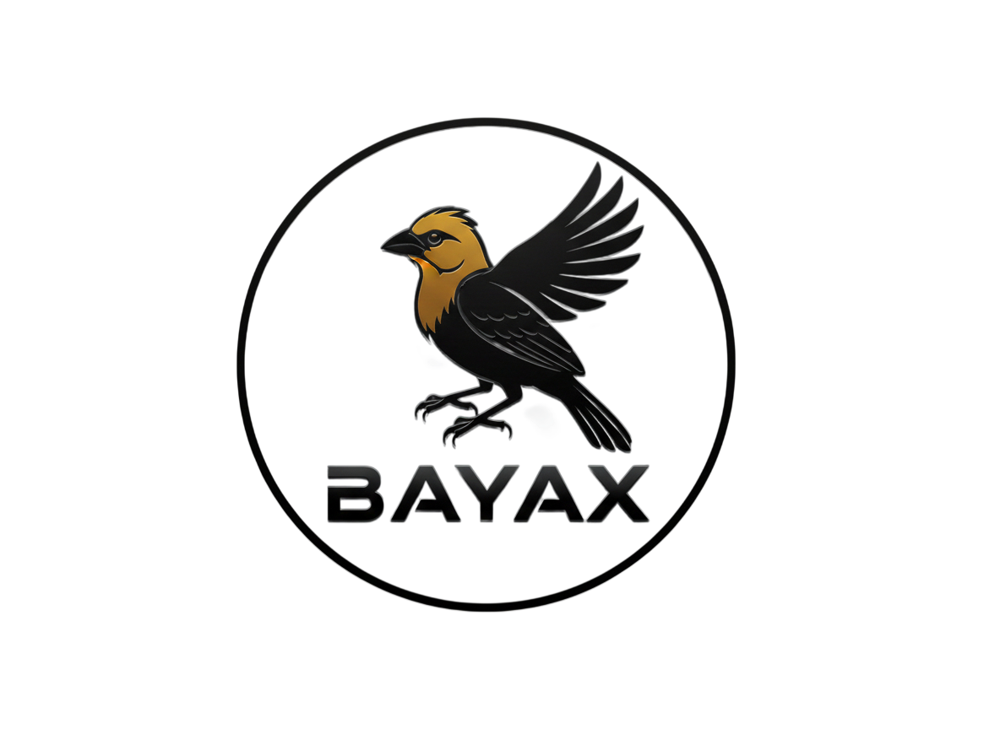

# 🚀 BayaX: The Idea-to-Execution Platform

<div align="center">
  
  <h1>BayaX</h1>
  <p><strong>Turn Confusion Into Execution.</strong></p>
  <p>No more vague ideas. BayaX uses multi-agent AI to break your thoughts into structured, visual, and executable plans.</p>

  <a href="https://bayax.vercel.app">View Demo</a> • <a href="#contributing">Contribute</a> • <a href="#license">License</a>
</div>

---

## 🔥 Features

- **🧠 Multi-Agent Analysis**:
  - **Strategist**: Breaks down high-level goals.
  - **Market Thinker**: Analyzes competition & monetization.
  - **Project Manager**: Creates daily task lists.
- **🗺️ Visual Logic Flow**: Interactive mind maps and logic trees (Topic -> Problem -> Solution -> Market).
- **📝 Execution Roadmap**: 30/60/90 day plans with actionable checklists.
- **📄 Export Ready**: Download your plan as PDF or export to Notion (Markdown).
- **🌗 Dark/Light Mode**: Premium glassmorphism UI.

---

## 🛠️ Tech Stack & Architecture

This project is built with a modern MERN stack + Python logic.

<div align="center">
  
</div>

| Component | Tech |
| :--- | :--- |
| **Frontend** | React, Vite, TailwindCSS, Framer Motion, Recoil, FontAwesome |
| **Backend** | Node.js, Express, MongoDB (Mongoose) |
| **AI Engine** | Google Gemini (1.5 Flash), Custom Prompt Engineering |
| **Utilities** | jsPDF, html2canvas, Axios |

---

## 📂 Repository Structure

```
BayaX/
├── client/                 # Frontend (React + Vite)
│   ├── src/
│   │   ├── components/     # Reusable UI components (BlurReveal, etc.)
│   │   ├── pages/          # Main route pages (Home, IdeaResult, Dashboard)
│   │   ├── recoil/         # State management
│   │   └── assets/         # Images and fonts
├── server/                 # Backend (Node.js + Express)
│   ├── controller/         # Logic for Ideas, Users, etc.
│   ├── models/             # MongoDB Schemas
│   └── index.js            # Entry point
└── README.md
```

---

## 🚀 Getting Started

### Prerequisites
- Node.js (v18+)
- MongoDB connection string
- Google Gemini API Key

### Installation

1. **Clone the repo**
   ```bash
   git clone https://github.com/samay-hash/BayaX.git
   cd BayaX
   ```

2. **Setup Server**
   ```bash
   cd server
   npm install
   # Create .env file with:
   # MONGO_URL=...
   # GEMINI_API_KEY=...
   # PORT=3004
   npm run dev
   ```

3. **Setup Client**
   ```bash
   cd client
   npm install
   npm run dev
   ```

---

## 🤝 Contribution

We welcome builders! Open an issue or submit a PR.
1. Fork the Project
2. Create your Feature Branch (`git checkout -b feature/AmazingFeature`)
3. Commit your Changes (`git commit -m 'Add some AmazingFeature'`)
4. Push to the Branch (`git push origin feature/AmazingFeature`)
5. Open a Pull Request

---

## 📜 License

Distributed under the MIT License. See `LICENSE` for more information.

---

<div align="center">
  <sub>Built by <a href="https://twitter.com/ChemistGamer1">Samay</a></sub>
</div>
